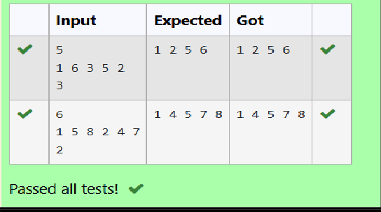

# Ex4(C) B-Tree
## DATE:9-04-2025
## AIM:
To write a C function to delete an element in a B Tree.
## Algorithm
1. Start
2. Try to delete the item from the node using delValFromNode. If not found, print "Not 
present" and return.
3. If the node's count is 0 after deletion, set tmp to the current node and update myNode to its 
first linker child.
4. Free the tmp node.
5. Update the global root to the new myNode.
6. Return after deletion.
7. End

## Program:
```
/*
Program to write a C function to delete an element in a B Tree
Developed by:MARELLA HASINI 
RegisterNumber:212223240083  
*/
/*structBTreeNode{
int item[MAX+1], count;
structBTreeNode*linker[MAX +1];
};
structBTreeNode*root;*/
void delete(int item,structBTreeNode*myNode) { 
structBTreeNode*tmp;
if(!delValFromNode(item,myNode)) { 
printf("Not present\n");
return;
}else {
if(myNode->count ==0) { 
tmp = myNode;
myNode=myNode->linker[0]; 
free(tmp);
}
}
root=myNode; 
return;
}
```

## Output:



## Result:
Thus, the C function to delete an element in a B Tree is implemented successfully.
