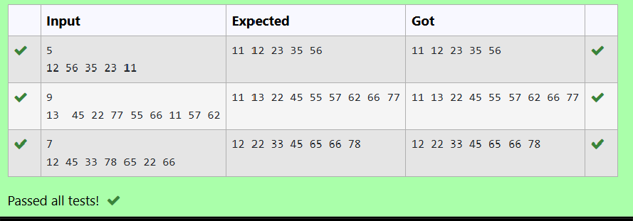

# Ex4(D) B+ Tree
## DATE:16-04-2025
## AIM:
To write a C function to traverse the elements in a B+ Tree.

## Algorithm
/*struct B_TreeNode
{
int *data;
structB_TreeNode**child_ptr; 
int leaf;
int n;
};
structB_TreeNode*root =NULL, *np=NULL, *x=NULL;*/
void traverse(structB_TreeNode*p)
{
int i;
for(i=0;i<p->n;i++)
{
if(p->leaf==0)
{
traverse(p->child_ptr[i]);
}
printf("%d",p->data[i]);
}
if(p->leaf==0)
{
traverse(p->child_ptr[i]);
}
}

## Program:
```
/*
Program to traverse the elements in a B+ Tree.
Developed by:MARELLA HASINI
RegisterNumber:212223240083 
*/
/*struct B_TreeNode
{
int *data;
structB_TreeNode**child_ptr; 
int leaf;
int n;
};
structB_TreeNode*root =NULL, *np=NULL, *x=NULL;*/
void traverse(structB_TreeNode*p)
{
int i;
for(i=0;i<p->n;i++)
{
if(p->leaf==0)
{
traverse(p->child_ptr[i]);
}
printf("%d",p->data[i]);
}
if(p->leaf==0)
{
traverse(p->child_ptr[i]);
}
}
```

## Output:



## Result:
Thus, the function to traverse the elements in a B+ Tree is implemented successfully.
