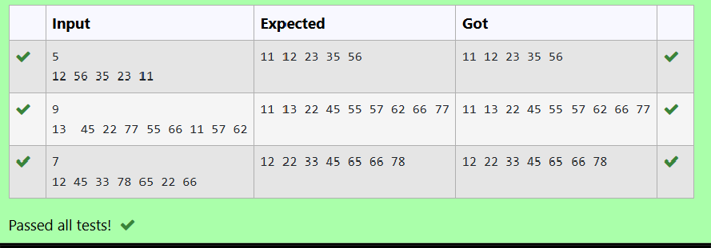

# Ex20 AVL Tree - Deletion
## DATE:18-04-2025
## AIM:
To write a C function to delete an element from an AVL Tree.
## Algorithm
1. Start
2. Iterate through each element in the node's data array.
3. If the node is not a leaf, recursively call traverse on the current child pointer.
4. Print the current data element.
5. After the loop, if the node is not a leaf, traverse the last child pointer.
6. Return after completing the traversal.
7. End

## Program:
```
/*
Program to find and display the priority of the operator in the given Postfix expression
Developed by:MARELLA HASINI 
RegisterNumber:212223240083 
*/
/*struct B_TreeNode
{
int *data;
structB_TreeNode**child_ptr; 
int leaf;
int n;
};
structB_TreeNode*root =NULL, *np=NULL, *x=NULL;*/
void traverse(structB_TreeNode*p)
{
int i;
for(i=0;i<p->n;i++)
{
if(p->leaf==0)
{
traverse(p->child_ptr[i]);
}
printf("%d",p->data[i]);
}
if(p->leaf==0)
{
traverse(p->child_ptr[i]);
}
}
```

## Output:



## Result:
Thus, the C program to delete an element from an AVL Tree is implemented successfully.
